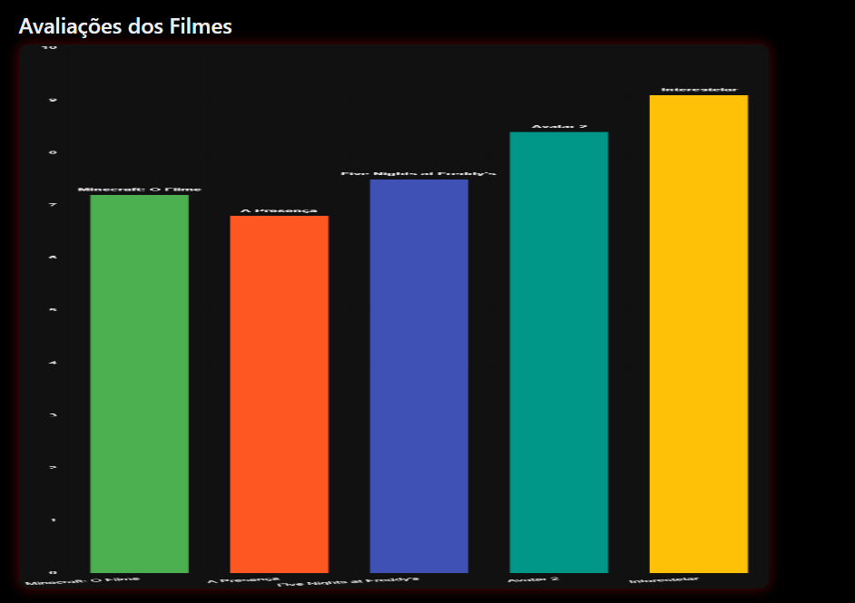
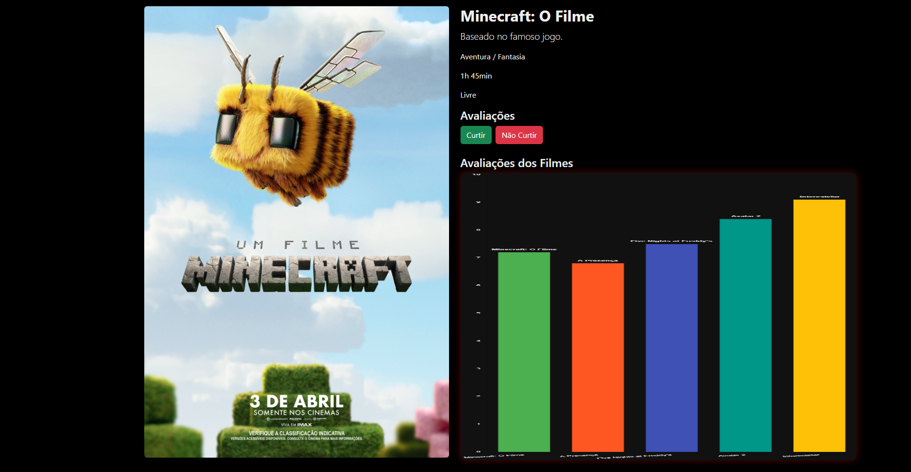

# Trabalho Prático - Semana 14

A partir dos dados cadastrados na etapa anterior, vamos trabalhar formas de apresentação que representem de forma clara e interativa as informações do seu projeto. Você poderá usar gráficos (barra, linha, pizza), mapas, calendários ou outras formas de visualização. Seu desafio é entregar uma página Web que organize, processe e exiba os dados de forma compreensível e esteticamente agradável.

Com base nos tipos de projetos escohidos, você deve propor **visualizações que estimulem a interpretação, agrupamento e exibição criativa dos dados**, trabalhando tanto a lógica quanto o design da aplicação.

Sugerimos o uso das seguintes ferramentas acessíveis: [FullCalendar](https://fullcalendar.io/), [Chart.js](https://www.chartjs.org/), [Mapbox](https://docs.mapbox.com/api/), para citar algumas.

## Informações do trabalho

- Nome:Gabriel Egídio Santos Beloni
- Matricula:885080
- Proposta de projeto escolhida:Catálago de filmes
- Breve descrição sobre seu projeto:A ideia do projeto se da com forma em um site para catalogar filmes de diversos gêneros, idade, público e fama. Neste site o objetivo é organizar com destaques e sugestões de novidades do cinema, tal site vai ser dividido em categorias específicas, ou uma home-page geral, com isso na página principal, o propósito é dividir em um filme destaque, novidades e abaixo indicações de filmes de diversos gêneros.

**Print da tela com a implementação**

<< Foi feito um gráfico exibido em todas as páginas dos filmes, os quais são exibidas as notas de todos os filmes cadastrados a fim de mostrar a ideia de comparação entre todos eles e suas respectivas notas para ajudar o usuário na hora de escolher o seu filme>>

<<   >>

<<   >>
